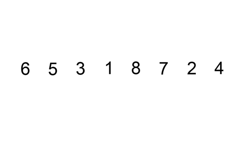
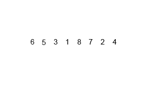

# Trabalho de implementação dos algoritmos de ordenação

## Algoritmos 💻

- Selection Sort (ordenação por seleção)
- Bubble Sort
- Insertion Sort (ordenação por inserção)
- Merge Sort (ordenação por intercalação)
- Quick Sort (ordenação rápida)
- Heap Sort
- Counting Sort
- Radix Sort
- Bucket Sort

## Aprendizados 📚

## 1. Selection Sort (Ordenação por seleção)
- O algoritmo percorre a lista várias vezes, a cada passada selecionando o menor (ou maior) elemento e colocando-o na posição correta.

- Mostra a importância de identificar mínimos/máximos e fazer trocas controladas.

- Utilizamos dois laços for aninhados, onde um percorre a lista e o outro busca o menor elemento no restante da lista.

- O Selection Sort sempre faz o mesmo número de comparações, independente da entrada:
``O(n²)`` no pior, médio e melhor caso.
Isso é útil para começar a entender análise de complexidade.

- 

## 2. Bubble Sort

- O Bubble Sort percorre a lista várias vezes, comparando elementos adjacentes e trocando-os de posição se estiverem fora de ordem.
- Isso nos ensina a detectar e corrigir posições erradas passo a passo.

- O nome "bubble" vem da ideia de que os maiores elementos "sobem" para o final da lista (como bolhas de ar na água).

- Podemos introduzir uma otimização que interrompe o algoritmo caso nenhuma troca seja feita em uma passada, mostrando a ideia de verificação de estado para melhorar desempenho.

- Mesmo com a otimização, a complexidade no pior caso ainda é ``O(n²)``.

- Melhor caso (lista já ordenada): ``O(n)`` com a otimização.

- Isso introduz a ideia de casos melhores e piores de desempenho.

- 

## 3. Insertion Sort

- A lógica do Insertion Sort é pegar um elemento e inseri-lo na posição correta dentro da parte da lista que já está ordenada.

- Assim como o Selection Sort, aprendemos a dividir a lista entre a parte ordenada e a não ordenada, mas aqui a inserção acontece de forma dinâmica, deslocando elementos conforme necessário.

- Ao inserir um novo elemento, outros precisam ser deslocados para a direita. Isso ensina como mover elementos dentro de uma estrutura como listas.

- Insertion Sort é mais rápido que Selection e Bubble Sort quando a lista está quase ordenada, com desempenho ``O(n)`` no melhor caso.

- 

## 4. Merge Sort

- O Merge Sort aplica a estratégia de "dividir para conquistar".

- Divide o problema em subproblemas menores (quebrando a lista ao meio), resolve os subproblemas (ordenando as metades), e combina (merge) os resultados em uma única lista ordenada.

- Merge Sort é naturalmente recursivo.

- Junta duas listas ordenadas em uma só.

- Merge Sort tem complexidade ``O(n log n)`` em todos os casos (melhor, médio e pior).

- 

## 5. Counting Sort

- Counting Sort é um algoritmo não-comparativo — ele conta quantas vezes cada valor aparece, em vez de comparar elementos.

- Isso mostra que nem toda ordenação precisa de ``if A > B`` para funcionar.

- O algoritmo só funciona bem quando sabemos o intervalo dos valores (por exemplo, de 0 a 100). Isso ensina que algoritmos podem ser super rápidos se usamos conhecimento extra sobre os dados. Exemplo: ordenar notas de alunos entre 0 e 10, ou idades entre 0 e 120.

- O Counting Sort usa um array auxiliar (vetor de contagem) para armazenar quantas vezes cada valor aparece.

- Quando os dados estão dentro de um intervalo pequeno, o Counting Sort tem complexidade ``O(n + k)``, onde:
  - ``n`` é o número de elementos,
  - ``k`` é o valor máximo (domínio dos dados).

- 

## 6. Quick sort

- Assim como o Merge Sort, o Quick Sort divide o problema em partes menores

- Escolhe um ``pivô`` Coloca os elementos menores à esquerda e maiores à direita (particiona) e aplica o mesmo processo recursivamente

- O algoritmo usa recursão para ordenar as sublistas criadas após a partição.

- Com isso aprendemos a importância da condição de parada e da chamada de função sobre subconjuntos

- A etapa de particionar a lista em torno de um pivô é o coração do Quick Sort

- Nos ensina a controlar índices (ex: dois ponteiros), fazer comparações e organizar os dados em tempo linear.

- A performance do Quick Sort depende da escolha do pivô

- Se for o pior possível (ex: sempre o maior ou menor), o algoritmo vira ``O(n²)``

- Com pivôs aleatórios ou do meio, atinge ``O(n log n)`` na média.

- 