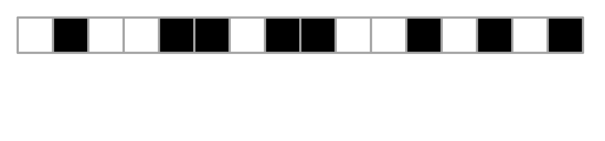

# Trabalho de implementação dos algoritmos de ordenação

## Algoritmos 💻

- Selection Sort (ordenação por seleção)
- Bubble Sort
- Insertion Sort (ordenação por inserção)
- Merge Sort (ordenação por intercalação)
- Quick Sort (ordenação rápida)
- Heap Sort
- Counting Sort
- Radix Sort
- Bucket Sort

## Aprendizados 📚

## 1. Selection Sort (Ordenação por seleção)
- O algoritmo percorre a lista várias vezes, a cada passada selecionando o menor (ou maior) elemento e colocando-o na posição correta.

- Mostra a importância de identificar mínimos/máximos e fazer trocas controladas.

- Utilizamos dois laços for aninhados, onde um percorre a lista e o outro busca o menor elemento no restante da lista.

- O Selection Sort sempre faz o mesmo número de comparações, independente da entrada:
``O(n²)`` no pior, médio e melhor caso.
Isso é útil para começar a entender análise de complexidade.

- 

## 2. Bubble Sort

- O Bubble Sort percorre a lista várias vezes, comparando elementos adjacentes e trocando-os de posição se estiverem fora de ordem.
- Isso nos ensina a detectar e corrigir posições erradas passo a passo.

- O nome "bubble" vem da ideia de que os maiores elementos "sobem" para o final da lista (como bolhas de ar na água).

- Podemos introduzir uma otimização que interrompe o algoritmo caso nenhuma troca seja feita em uma passada, mostrando a ideia de verificação de estado para melhorar desempenho.

- Mesmo com a otimização, a complexidade no pior caso ainda é ``O(n²)``.

- Melhor caso (lista já ordenada): ``O(n)`` com a otimização.

- Isso introduz a ideia de casos melhores e piores de desempenho.

- 

## 3. Insertion Sort

- A lógica do Insertion Sort é pegar um elemento e inseri-lo na posição correta dentro da parte da lista que já está ordenada.

- Assim como o Selection Sort, aprendemos a dividir a lista entre a parte ordenada e a não ordenada, mas aqui a inserção acontece de forma dinâmica, deslocando elementos conforme necessário.

- Ao inserir um novo elemento, outros precisam ser deslocados para a direita. Isso ensina como mover elementos dentro de uma estrutura como listas.

- Insertion Sort é mais rápido que Selection e Bubble Sort quando a lista está quase ordenada, com desempenho ``O(n)`` no melhor caso.

- 

## 4. Merge Sort

- O Merge Sort aplica a estratégia de "dividir para conquistar".

- Divide o problema em subproblemas menores (quebrando a lista ao meio), resolve os subproblemas (ordenando as metades), e combina (merge) os resultados em uma única lista ordenada.

- Merge Sort é naturalmente recursivo.

- Junta duas listas ordenadas em uma só.

- Merge Sort tem complexidade ``O(n log n)`` em todos os casos (melhor, médio e pior).

- 

## 5. Counting Sort

- Counting Sort é um algoritmo não-comparativo — ele conta quantas vezes cada valor aparece, em vez de comparar elementos.

- Isso mostra que nem toda ordenação precisa de ``if A > B`` para funcionar.

- O algoritmo só funciona bem quando sabemos o intervalo dos valores (por exemplo, de 0 a 100). Isso ensina que algoritmos podem ser super rápidos se usamos conhecimento extra sobre os dados. Exemplo: ordenar notas de alunos entre 0 e 10, ou idades entre 0 e 120.

- O Counting Sort usa um array auxiliar (vetor de contagem) para armazenar quantas vezes cada valor aparece.

- Quando os dados estão dentro de um intervalo pequeno, o Counting Sort tem complexidade ``O(n + k)``, onde:
  - ``n`` é o número de elementos,
  - ``k`` é o valor máximo (domínio dos dados).

- 

## 6. Quick sort

- Assim como o Merge Sort, o Quick Sort divide o problema em partes menores

- Escolhe um ``pivô`` Coloca os elementos menores à esquerda e maiores à direita (particiona) e aplica o mesmo processo recursivamente

- O algoritmo usa recursão para ordenar as sublistas criadas após a partição.

- Com isso aprendemos a importância da condição de parada e da chamada de função sobre subconjuntos

- A etapa de particionar a lista em torno de um pivô é o coração do Quick Sort

- Nos ensina a controlar índices (ex: dois ponteiros), fazer comparações e organizar os dados em tempo linear.

- A performance do Quick Sort depende da escolha do pivô

- Se for o pior possível (ex: sempre o maior ou menor), o algoritmo vira ``O(n²)``

- Com pivôs aleatórios ou do meio, atinge ``O(n log n)`` na média.

- 

## 7. Radix sort

- O Radix Sort ordena os elementos dígito por dígito, geralmente do menos significativo (LSD) para o mais significativo (MSD).

- sso ensina que é possível ordenar por "camadas" ou critérios secundários, um conceito útil para ordenações complexas (ex: nomes por sobrenome, depois por nome).

- O Radix Sort depende de um algoritmo de ordenação estável para funcionar corretamente em cada dígito (geralmente o Counting Sort).

- Funciona muito bem com números inteiros dentro de um intervalo de comprimento razoável. Dados com comprimento fixo (ex: números com até 6 dígitos, ou códigos postais, CPF etc).

- Quando ``n`` é o número de elementos e ``k`` o número de dígitos, o Radix Sort tem complexidade ``O(n × k)``.

- Em muitos casos práticos, isso é quase linear ``(O(n))``, tornando-o muito rápido.

- Isso reforça a ideia de eficiência além da comparação, diferente de algoritmos como Quick/Merge que têm limites teóricos de ``O(n log n)`` com comparações.

- Assim como Merge e Counting Sort, o Radix Sort usa memória extra para listas auxiliares.

- Vantagens do Radix Sort

  - Quando os dados são inteiros com um número de dígitos fixo e limitado, o Radix Sort pode ter desempenho quase linear ``(O(n))``, o que é melhor que os ``O(n log n)`` dos algoritmos baseados em comparação.

  - Ele ordena com base em posições/dígitos, o que pode ser uma grande vantagem para tipos específicos de dados ``(ex: CPFs, CEPs, IDs, etc.)``.

  - Como não depende de comparações, não sofre com os piores casos do Quick Sort (por exemplo, quando a lista está quase ordenada).

- Desvantagens do Radix sort

  - Só funciona bem com certos tipos de dados! Precisa que os dados sejam números inteiros (ou convertíveis) e que o número de dígitos seja limitado.

  - Consome muita memoria! Usa estruturas auxiliares (como arrays/buckets) para cada dígito, o que pode ser um problema em sistemas com memória limitada.

  - Implementação mais complexa! É mais difícil de implementar corretamente, especialmente com dados negativos, strings ou objetos personalizados.

  - Desempenho depende do comprimento dos dados! Se os números tiverem muitos dígitos (por exemplo, números com 20 dígitos), o algoritmo faz muitas passagens e pode ficar lento

- 

## 8. Bucket sort

- Distribuição em faixas (bucketização)! O Bucket Sort distribui os elementos em baldes (subconjuntos) com base em seus valores (ex: de 0.0 a 0.1, de 0.1 a 0.2, etc.).

- Aprendemos a organizar dados em categorias/fatigamentos antes de ordenar — útil para dados contínuos como números decimais ou probabilidades.

- Combinação de algoritmos! Cada "balde" pode ser ordenado com qualquer outro algoritmo (Insertion Sort é comum).

- Isso mostra a ideia de hibridização de algoritmos: usar o melhor algoritmo para cada parte do problema.

- Alocação dinâmica de estruturas! Trabalha com listas de listas (ou arrays de arrays), o que reforça habilidades com estrutura de dados dinâmicas.

- Eficiência em dados uniformemente distribuídos! Se os dados estiverem bem distribuídos, o Bucket Sort pode chegar a tempo linear ``O(n)``.

- Não usa comparação direta globalmente! A ordenação global surge indiretamente pela ordenação local de baldes — outra forma de pensar fora do padrão "comparar elementos diretamente".

- Vantagens do Bucket sort
  - Muito rápido para dados bem distribuídos! Quando os dados estão uniformemente distribuídos (ex: entre 0 e 1), pode funcionar em tempo linear ``(O(n))``.

  - Boa base para combinações! Pode ser combinado com outros algoritmos para otimizar desempenho, como usar Insertion Sort dentro dos baldes.

  - Simplicidade conceitual! A ideia de distribuir → ordenar → juntar é fácil de entender conceitualmente.

  - Funciona bem com números decimais! Diferente do Counting ou Radix, o Bucket Sort lida bem com valores fracionários (floats).

- Desvantagens do Bucket sort

  - Não funciona bem com dados desbalanceados! Se os dados estiverem todos concentrados em poucos baldes, ele perde eficiência (alguns baldes ficam vazios, outros cheios demais).

  - Escolher o número e intervalo dos baldes é difícil! Se não for feito corretamente, o desempenho cai bastante. Isso exige conhecimento prévio dos dados.

  - Não é in-place! Cria listas auxiliares (os baldes), logo consome mais memória.

  - Não é ideal para dados com alta variação! Funciona melhor com dados contínuos e normalizados (ex: números entre 0 e 1). Se os dados forem inteiros muito diferentes, outros algoritmos são melhores.

  - Estabilidade depende da ordenação interna! Por padrão, o Bucket Sort não é estável, a menos que use um algoritmo interno estável.

- 

# 9. Heap sort

- 